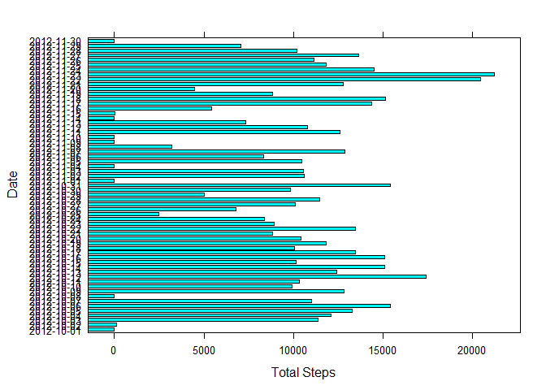
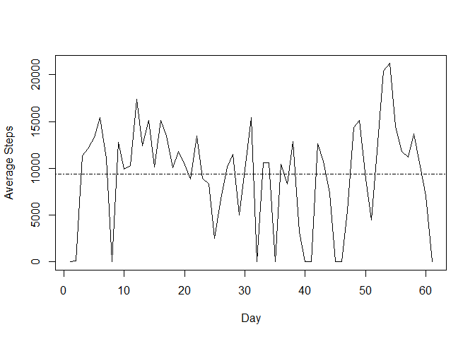
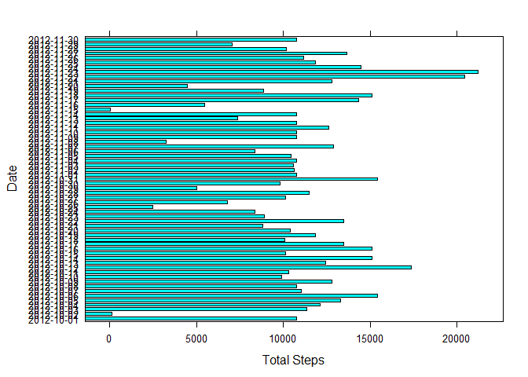
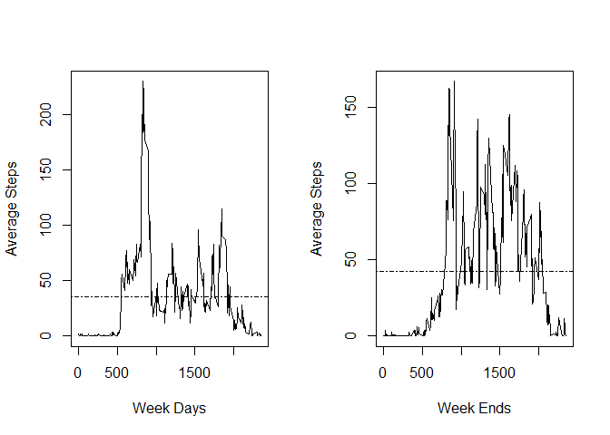

In this document, we will detail the process followed to extract, process and analyze the data contained in the "activity.zip" data set.

## Code for Loading and preprocessing the data

The following code was used to read and pre-process the data. It makes use of the "dplyr" package for data manipulation, and the "lattice" package for producing some of the plots. After reading in the initial data set, which is stored in the variable 'act', two summaries are created from the original data: 'actByDay' records the sum of all steps for each day; and 'actByInt' records the average number of steps for each 5-minute time interval throughout the 61 days of observations.


```r
if(!file.exists("activity.zip")){
  download.file("")
}
if(!file.exists("activity.csv")){
  unzip("activity.zip")
}
require(dplyr)
```

```
## Loading required package: dplyr
```

```
## 
## Attaching package: 'dplyr'
```

```
## The following objects are masked from 'package:stats':
## 
##     filter, lag
```

```
## The following objects are masked from 'package:base':
## 
##     intersect, setdiff, setequal, union
```

```r
require(lattice)
```

```
## Loading required package: lattice
```

```r
act <- read.csv("activity.csv")
act$date <- as.Date(act$date)
actints <- sprintf("%04d",act$interval)
actByDay <- act %>% 
  group_by(date) %>% 
  summarise(sum_steps = sum(steps,na.rm = TRUE))
actByDay$day <- as.factor(weekdays(actByDay$date))
actByDay$day <- ordered(actByDay$day,levels=c("Sunday","Monday","Tuesday","Wednesday","Thursday","Friday","Saturday"))
actByInt <- act %>% 
  group_by(interval) %>% 
  summarize(mean_steps = mean(steps,na.rm=TRUE))
```

## Histogram of the total number of steps taken each day

The following histogram shows the sum of the steps taken on each day. It simply creates a bar chart showing the sum of the steps taken for each of the 61 days (as calculated in 'actByDay').


```r
with(actByDay, barchart(date ~ sum_steps,xlab="Total Steps",ylab="Date"))
```

<!-- -->


## Mean and median total number of steps taken each day

In order to display the mean and median steps taken each day, we need only call the r function 'summary', which will give us this information along with additional information about the minimum and maximum values, and the value of the 1st and 3rd quartiles.


```r
summary(actByDay$sum_steps)
```

```
##    Min. 1st Qu.  Median    Mean 3rd Qu.    Max. 
##       0    6778   10395    9354   12811   21194
```

## Time series plot of the average number of steps taken each day

In order to plot a time-series for the average number of steps per day over the 61 days of the observations, we simply need to turn the average steps per day (which was previously calculated and stored in the variable 'actByDay') into a time-series.


```r
stepsTS <- ts(actByDay$sum_steps)
plot.ts(stepsTS,xlab="Day",ylab="Average Steps")
abline(h=mean(actByDay$sum_steps),lty=4)
```

<!-- -->

## The 5-minute interval that contains the maximum average number of steps

The interval that contains the maximum of the average number of steps is already calculated in 'actByInt'. In order to extract the maximum from this data frame, we need only select the row with the value equal to the maximum value, as returned by a call to the max() function.


```r
actByInt[actByInt$mean_steps==max(actByInt$mean_steps,na.rm = TRUE),]
```

```
## # A tibble: 1 x 2
##   interval mean_steps
##      <int>      <dbl>
## 1      835       206.
```

## Strategy for Imputing missing values

The only column in our data set which includes missing values (which are marked as 'NA'), is the first column, which records the number of steps in a given interval on a given date. For these missing values in a particular interval, we will use the average value for that interval across all observations (i.e., mean steps across all 61 days). This has already been calculated and stored in the variable 'actByInt', so we need only join the information in 'actByInt' with our original dataset 'act' and use the value in the mean_steps column (column 4 of the newly created data set) in place of the 'NA' values in the steps variable (column 1).


```r
act2 <- dplyr::full_join(act, actByInt, by="interval")
act2[,1] <- ifelse(is.na(act2[,1]), act2[,4], act2[,1])
```

## Histogram of the total steps taken after values are imputed

With all 'NA' values replaced by the average for that interval, in order to display the histogram, we will recalulate the activity by day and plot it as a bar chart.


```r
actByDay2 <- act2 %>% 
  group_by(date) %>% 
  summarise(sum_steps = sum(steps,na.rm = TRUE))
actByDay2$day <- as.factor(weekdays(actByDay$date))
actByDay2$day <- ordered(actByDay$day,levels=c("Sunday","Monday","Tuesday","Wednesday","Thursday","Friday","Saturday"))
require(lattice)
with(actByDay2, barchart(date ~ sum_steps,xlab="Total Steps",ylab="Date"))
```

<!-- -->

## Panel plot comparing steps taken per interval across weekdays and weekends

The following output displays the average steps per day for each day of the week. This is calculated by grouping the data by the day of the week, and calculating the mean for each group. This utilizes the data set with the 'NA' values replaced by their interval mean values.


```r
actByDay2 %>% group_by(day) %>% summarize(mean_steps = mean(sum_steps))
```

```
## # A tibble: 7 x 2
##   day       mean_steps
##   <ord>          <dbl>
## 1 Sunday        12089.
## 2 Monday        10151.
## 3 Tuesday        8950.
## 4 Wednesday     11677.
## 5 Thursday       8496.
## 6 Friday        12006.
## 7 Saturday      12314.
```

In order to plot the steps taken per interval on weekdays versus the weekends, we must subset the original data set. This we do on the date, creating the variable 'actWE' for days equal to "Saturday" or "Sunday", and creating the variable 'actWD' for the other days ("Monday" through "Friday"). We then summarize each of these data sets by interval, calculating the mean number of steps for each interval.


```r
actWE <- subset(act2,weekdays(act2$date) %in% c("Saturday","Sunday"))
actWD <- subset(act2,weekdays(act2$date) %in% c("Monday","Tuesday","Wednesday","Thursday","Friday"))
actByIntWE <- actWE %>% 
  group_by(interval) %>% 
  summarize(mean_steps = mean(steps))
actByIntWD <- actWD %>% 
  group_by(interval) %>% 
  summarize(mean_steps = mean(steps))
par(mfrow=c(1,2))
par(yaxp=c(0,250,5))
plot(actByIntWD,type="l",xlab="Week Days",ylab="Average Steps")
abline(h=mean(actByIntWD$mean_steps), lty=4)
plot(actByIntWE,type="l",xlab="Week Ends",ylab="Average Steps")
abline(h=mean(actByIntWE$mean_steps), lty=4)
```

<!-- -->
